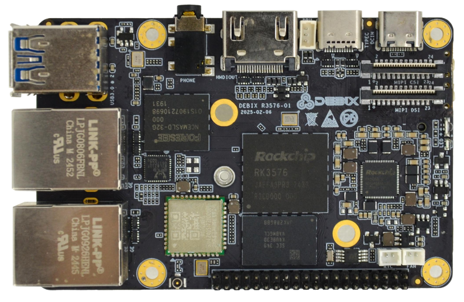
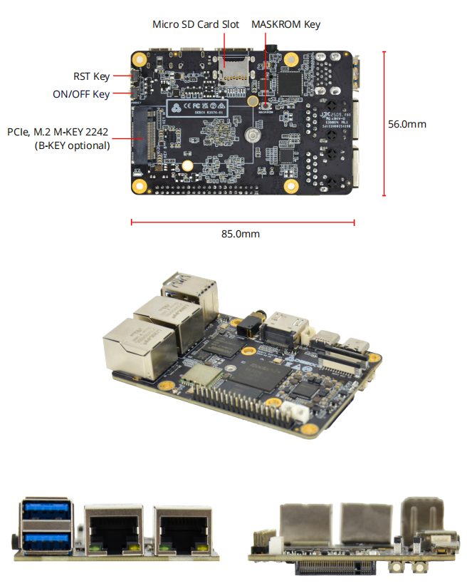

# DEBIX R3576-01 Single Board Computer
 

## Overview
The DEBIX R3576-01 is a commercial-grade single-board computer based on the Rockchip RK3576, which provides comprehensive system software development and rich and scalable I/O interfaces for rapid application in intelligent robotics, edge computing, internet of Things and security.

## Main Features
- **Powerful Performance:** Built for demanding commercial or consumer applications, DEBIX R3576-01 is equipped with an octa-core CPU architecture up to 2.2GHz, combining a quad-core ARM Cortex-A72 cluster and a quad-core ARM Cortex-A53 cluster, and with 2GB/4GB/8GB LPDDR4 RAM. This combination ensures smooth operation even for complex processing tasks.
- **Commercial-grade Build:** Designed for harsh environments, DEBIX R3576-01 features commercial-grade components and a wide CPU temperature range of 0°C to 70°C.
- **Rick Connectivity:** DEBIX R3576-01 offers a comprehensive range of connectivity options,including Gigabit Ethernet, 2.4GHz & 5GHz Wi-Fi 6, Bluetooth 5.0, high-speed USB 3.0, and PCIe support. This allows for easy connection and control of various peripherals.

## Specification
| System          |                                                                         |
|-----------------|-------------------------------------------------------------------------|
| CPU             | Rockchip RK3576, 4 x Cortex-A72+4 x Cortex-A53 up to 2.2GHz, comes with an integrated neural processing unit (NPU) that delivers up to 6 TOPS (RKNN), and with GPU G52 MC3  |
| Memory          | 2GB LPDDR4 (4GB/8GB optional)                                           |
| Storage         | 1\) Default: Onboard 32GB eMMC (8GB/16GB/64GB/128GB/256GB optional)  2\) Micro SD card 8GB/16GB/32GB/64GB/128GB/256GB optional  |
| OS              | Android 14, Debian 12, Ubuntu 20.04 Server                              |
| Boot Mode       | Boot from eMMC                                                          |
|**Communnication**|                                                                      
| Gigabit Network| 2 x Gigabit Ethernet Interfaces:  1\) 1 x RJ45 with PoE power supply (needs PoE power supply module)   2\) 1 x RJ45 |
| WiFi & BT       | 2.4GHz & 5GHz Wi-Fi 6, BT 5.0, external Wi-Fi SMA antenna connector     |
|**Video & Audio**|                                                                      
| HDMI            | 1 x HDMI output with Type-A HDMI female                                 |
| MIPI CSI        | 1 x MIPI CSI, supports 4-lane, 24Pin 0.5mm Pitch FPC socket             |
| MIPI DSI        | 1 x MIPI DSI, supports 4-lane, 24Pin 0.5mm Pitch FPC socket             |
| Audio           | 1 x 3.5mm headphone and microphone combo port                           |
| DP              | 1 x DP display supports MST with Type-C                                 |
|**I/O Interfaces**|
| USB             | 2 x USB 3.0 Host with double layer Type-A   1 x USB 2.0 PWR with Type-C for DC 5V power input   1 x USB 3.0 OTG + DP DISPLAY supports MST with Type-C
| M.2             | 1 x PCIe, M.2 M-KEY 2242 (B-KEY optional)                               |
| 40-Pin Dual-Row Header | 1\) Default: 3 x UART, 2 x SPI, 2 x I2C, 2 x CAN, 6 x GPIO, refer to DEBIX website "DEBIX R3576-01 GPIO Pin Multiplexing Function List", which can beconfigured to I2S, PWM, SPDIF, GPIO, etc. via software   2\) 5V power supply, system reset, ON/OFF     |
| Debug           | 1 x Debug, 1*3Pin/1.25mm wafer connector                                |
| RTC             | 1 x RTC, 1*2Pin/1.25mm wafer connector                                  |
| FAN             | 1 x FAN, 1*2Pin/1.25mm wafer connector                                  |
| Slot            | 1 x Micro SD card slot                                                  |
| Key             | 1 x MASKROM key   1 x ON/OFF key   1 x Reset key                  |
|**Power Supply**|
| Power Supply    | Default DC 5V/3A power input with Type-C interface                      |
|**Mechanical & Environmental**|
| Size (L x W)    | 85.0mm × 56.0mm (±0.5mm)                                                |
| Operating Temp. | 0°C to 70°C                                        |
| Net Weight      | 48g (±0.5g)                                                             |

## Product Compliance and Safety:
CE | RCM | C-Tick | FCC | UKCA | ROHS | PSE

## I/O Interfaces:

## Compatible with DEBIX's Accessories:
| Product                     | Model               |
|-----------------------------|---------------------|
| DEBIX Fanless Aluminum Enclosure | EMC-7090B R3576-01|
| SBC POE Board               | EMB-AS-06          |
| DEBIX Display Screen        | DEBIX TD080B;  DEBIX TD050H;  DEBIX TD070H;  DEBIX TD101H |

## Safety Instructions and Warnings:
**General:**
- Avoid exposure to water, moisture and conductive surfaces while operating.
- Handle with care to avoid mechanical or electrical damage to the circuit board and connectors.
- Only handle the board by the edges when powered on to minimize the risk of electrostatic discharge damage.

**Power:**
- Use only a 5V/3A DC minimum external power supply that complies with relevant regulations and standards for your country.

**Environment:**
- Operate in a well-ventilated environment, even if using a case.
- Place on a stable, flat, non-conductive surface and avoid contact with conductive items.

**Connections:**
- Only connect compatible devices to the GPIO ports to avoid damage and warranty
voiding.
- Use peripherals that comply with relevant standards for the country of use and ensure proper insulation and operation.

**Additional notes:**
- This summary is not exhaustive, please refer to the full User Manual for details.
- If you are unsure about any aspect of safety or operation, consult a qualified
professional.

## Contact Us
- **Headquarters**: DEBIX Technology Inc., 8345 Gold River Ct., Las Vegas, NV 89113, USA  
- **Factory**: 5-6/F., East Zone, Shunheda A2 Building, Liqxiandong Industrial Park, XiLi, Nanshan Dist., Shenzhen, China  
- **Email**: info@debix.io  
- **Website**: [www.debix.io](https://www.debix.io)  
- **Community**: [Discord](https://discord.com/invite/adaHHaDkH2)